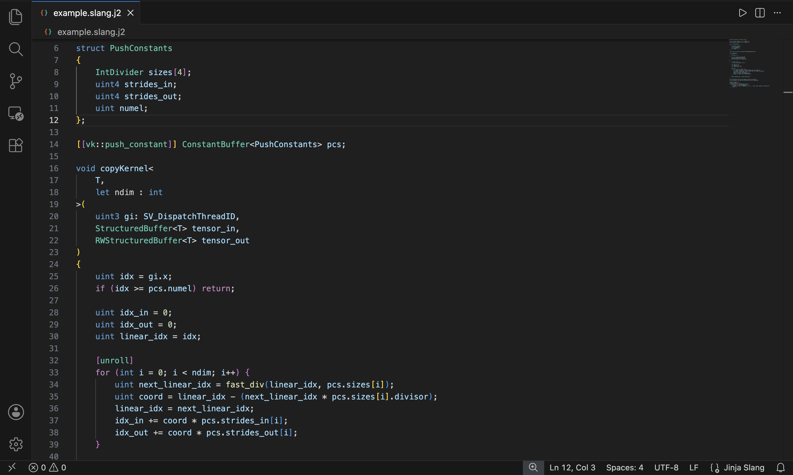

# Jinja Slang for VSCode

Adds syntax highlighting for Jinja2 templates used to generate Slang shaders.

## Features
Provides syntax highlighting for Jinja2 tags (``, `{{ variable }}`) embedded within Slang shader code, ensuring both template logic and shader syntax remain readable.

## Usage
Save your files with the `.slang.j2` extension. VS Code will automatically recognize the file type and apply the correct highlighting rules.

## Requirements
You need these two extensions installed for this to work (VS Code should download them automatically when you install this one):
* [Jinja](https://marketplace.visualstudio.com/items?itemName=wholroyd.jinja) (`wholroyd.jinja`)
* [Slang Language Extension](https://marketplace.visualstudio.com/items?itemName=shader-slang.slang-language-extension) (`shader-slang.slang-language-extension`)

## Source
[GitHub Repository](https://github.com/ZainSharief/jinja-slang)